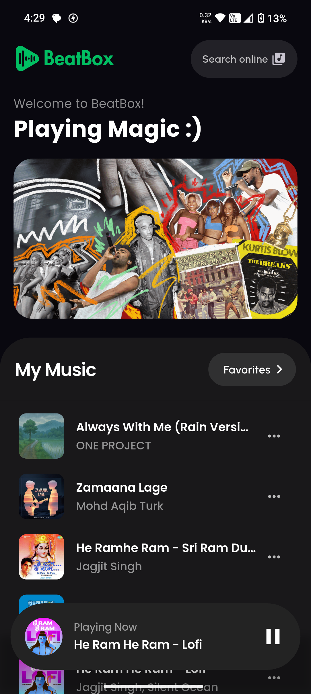
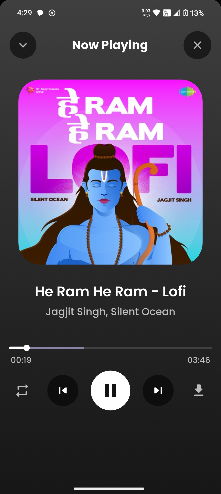
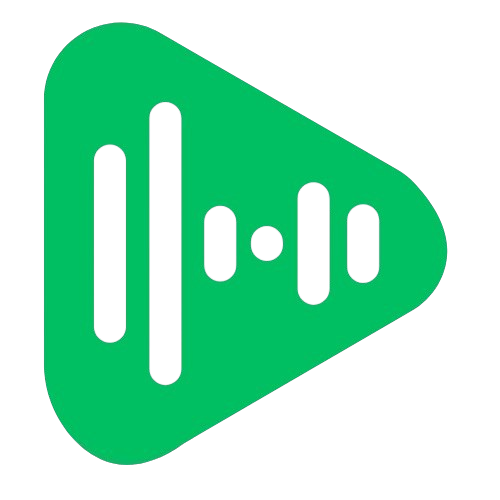
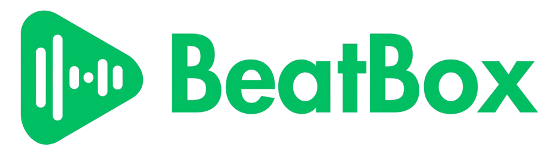

 

 # BeatBox Music Player 

  
 ## Overview 
 BeatBox Music Player is a Flutter-based Android application developed by [decodeaditya](https://github.com/decodeaditya) to provide a seamless music listening experience. Featuring a modern, dark-themed interface, it offers intuitive playback controls and personalized features like favorites and recently played tracks. This project is open source, welcoming contributions from the community, but it remains the intellectual property of [decodeaditya](https://github.com/decodeaditya). Contributors may not claim the project as their own or remove the original author's attribution. 
  
 ## Purpose 
 This project showcases my skills in Flutter development, audio playback integration, and mobile app design. As an open-source project, it invites developers to contribute enhancements, fix bugs, or suggest features while respecting the project's ownership and license terms. The app is designed for Android users to enjoy music with a clean and responsive interface. 
  
 ## Screenshots 
 Explore the BeatBox Music Player interface through these screenshots: 
  
 | Home Screen | Player Screen | Favorites | 
 |-------------|--------------|-----------| 
 |  |  |  | 
   
  
 ## Features 
 - **Music Playback**: Smooth playback with controls for play, pause, skip, repeat, and shuffle. 
 - **Favorites**: Save favorite tracks for quick access (stored locally using Hive, if applicable). 
 - **Recently Played**: Access a history of recently played songs. 
 - **Responsive UI**: Modern, dark-themed interface optimized for Android devices. 
 - **Background Playback**: Continue listening while using other apps (via `audio_service`, if implemented). 
 - **Offline Support**: Cache tracks for offline playback (if implemented). 
  
 
  
 ## Usage 
 1. **Launch the App**: Open BeatBox on an Android device or emulator. 
 2. **Browse Tracks**: Explore available tracks or playlists. 
 3. **Control Playback**: Use buttons to play, pause, skip, shuffle, or repeat tracks. 
 4. **Manage Favorites**: Add or remove tracks from your favorites list. 
 5. **View History**: Access recently played songs for quick replay. 
  
 ## Download Now 
 Experience BeatBox Music Player on your Android device! 
  
 - **GitHub Releases**:


 
  [](https://github.com/decodeaditya/BeatBox-music-player/releases)
  
   Download the latest APK for sideloading. 
 - **System Requirements**: Android 5.0 (Lollipop) or later. 
  
 ## Website 
 Visit the official website for BeatBox Music Player to learn more: 
 [BeatBox Music Player Website](https://beatboxplayer.netlify.app) (Update with actual website URL). 
  
 ## Graphics and Logo 
 Check out the BeatBox Music Player logo: 
  
   
   
  
 ## Project Structure 
 ``` 
 Beatbox_App/ 
 ├── lib/                  # Flutter source code 
 │   ├── main.dart         # App entry point 
 │   ├── pages/            # UI screens (e.g., home, player, favorites) 
 │   ├── models/           # Data models (e.g., Track, Playlist)
 │   └── components/       # Reusable UI components 
 ├── assets/               # Audio files, images, and other assets 
 │   ├── sounds/           # Audio files for tracks 
 │   └── images/           # App icon, album art 
 ├── pubspec.yaml          # Flutter dependencies and configuration 
 └── README.md             # Project documentation 
 ``` 

 ## Tech Stack 
 - **Flutter**: Cross-platform framework for the app's UI and logic. 
 - **Dart**: Programming language for Flutter development. 
 - **just_audio**: For audio playback and background controls. 
 - **audio_service**: For background audio playback integration (if used). 
 - **Hive**: Lightweight NoSQL database for storing favorites and recently played tracks (if implemented). 
 - **Firebase**: For backend services like authentication or cloud storage (if applicable). 
  
 ## Installation (For Development) 
 To explore or contribute to BeatBox Music Player: 
  
 1. **Prerequisites**: 
    - Install [Flutter](https://flutter.dev/docs/get-started/install) (stable channel, version 3.0 or later). 
    - Set up a compatible IDE (e.g., VS Code, Android Studio) with Flutter and Dart plugins. 
    - Use an Android emulator or physical device for testing. 
  
 2. **Clone the Repository**: 
    ```bash 
    git clone https://github.com/decodeaditya/BeatBox-music-player.git 
    ``` 
  
 3. **Navigate to the Project Directory**: 
    ```bash 
    cd BeatBox-music-player 
    ``` 
  
 4. **Install Dependencies**: 
    ```bash 
    flutter pub get 
    ``` 
  
 5. **Run the App**: 
    ```bash 
    flutter run 
    ``` 
    This launches the app on your connected device or emulator. 
  
 ## Contributing 
 BeatBox Music Player is an open-source project, and contributions are welcome! To contribute: 
 1. Fork the repository. 
 2. Create a new branch (git checkout -b feature/your-feature). 
 3. Make your changes and commit (git commit -m "Add your feature"). 
 4. Push to the branch (git push origin feature/your-feature). 
 5. Open a pull request. 
  
 Please ensure your contributions: 
 - Follow [Flutter's style guidelines](https://flutter.dev/docs/development/tools/formatting). 
 - Include appropriate comments and documentation. 
 - Respect the original authorship by retaining attribution to [decodeaditya](https://github.com/decodeaditya). 
 - Do not claim the project as your own or distribute it without adhering to the license. 
  
 Submit bug reports or feature suggestions via the [Issues](https://github.com/decodeaditya/BeatBox-music-player/issues) page. 
  
 ## Usage Disclaimer 
 This project is open source under the MIT License but is the intellectual property of [decodeaditya](https://github.com/decodeaditya). You may: 
 - View, fork, or contribute to the code. 
 - Download and test the app on your Android device. 
 - Suggest improvements via issues or pull requests. 
  
 You may not: 
 - Claim the project as your own or remove the original author's attribution. 
 - Use the code or app for commercial purposes without explicit permission from [decodeaditya](https://github.com/decodeaditya). 
 - Distribute modified versions without adhering to the license terms. 
  
 ## License 
 This project is licensed under the MIT License, with the condition that attribution to [decodeaditya](https://github.com/decodeaditya) must be retained. See the [LICENSE](LICENSE) file for details. 
  
 ## Acknowledgments 
 - Built with [Flutter](https://flutter.dev/) and [Dart](https://dart.dev/). 
 - Audio playback powered by [just_audio](https://pub.dev/packages/just_audio) and [audio_service](https://pub.dev/packages/audio_service) (if used). 
 - Local storage powered by [Hive](https://pub.dev/packages/hive) (if implemented). 
 - Thanks to the open-source community for tools and libraries. 
  
 ## Contact 
 For feedback, inquiries, or collaboration opportunities, reach out to [decodeaditya](https://github.com/decodeaditya) on GitHub. 