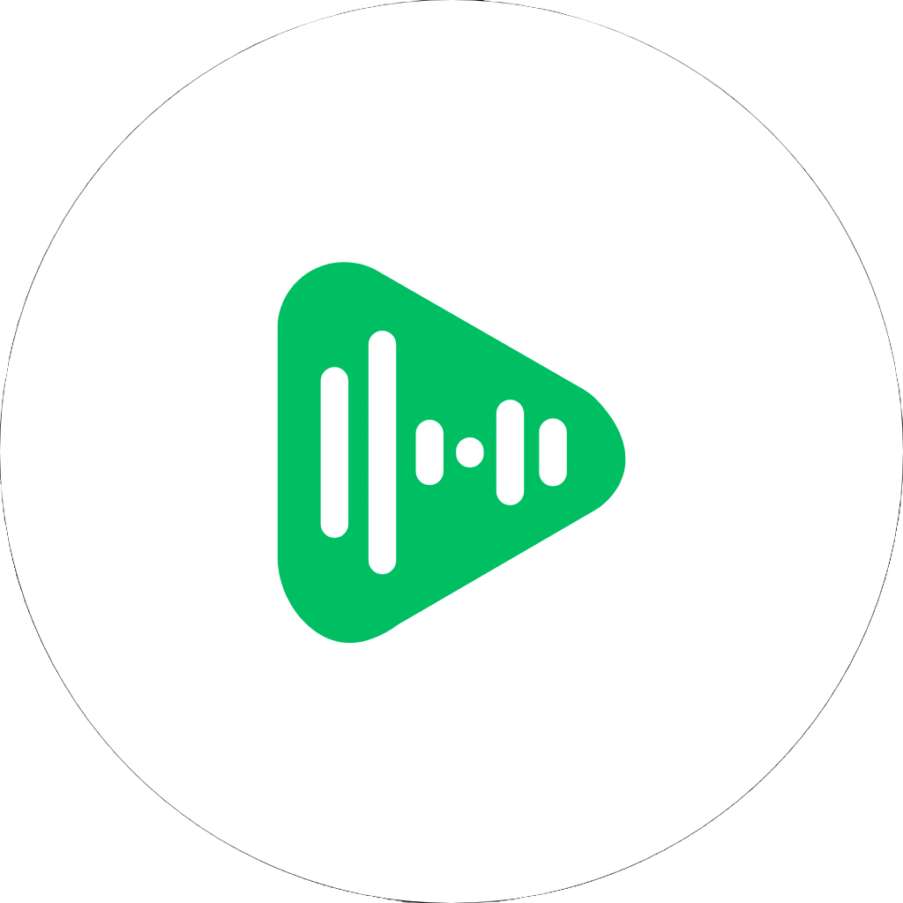
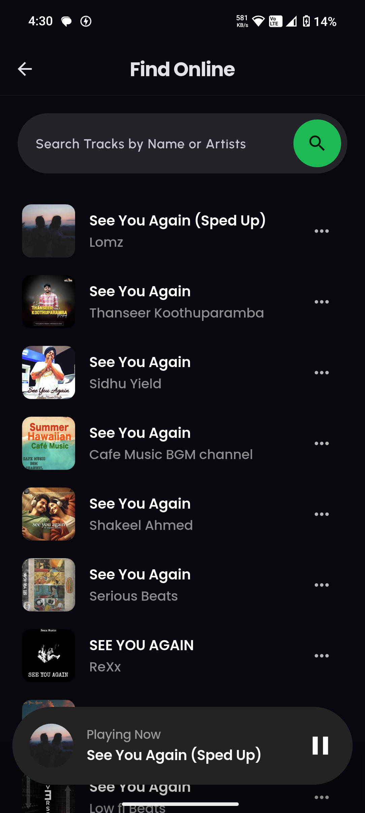

<p align="center">
  
</p>

<!-- BeatBox Logo -->
<p align="center">
  
</p>

<h1 align="center">🎵 BeatBox Music Player</h1>

<p align="center"><em>A minimal, dark-themed Flutter music player for Android users who love simplicity, style, and immersive sound.</em></p>

---

## 🌟 Overview

**BeatBox** is a lightweight, modern music player built using **Flutter**. It features a simple and intuitive interface that lets users play, pause, shuffle, and bookmark favorite tracks — all in an eye-pleasing dark UI.

> Developed with ❤️ by [@decodeaditya](https://github.com/decodeaditya)  
> Open-source for educational and non-commercial use.

---

## 🚀 Features

- ▶️ **Play, Pause, Skip** – All basic playback controls
- ⭐ **Favorites Management** – Mark and revisit your favorite tracks
- 🕘 **Recently Played** – Automatic listening history
- 🌙 **Dark Theme UI** – Energetic, comfortable visuals
- 🔁 **Background Playback** – Keep playing even while switching apps
- 📁 **Offline Files** – Play from your local storage (permission required)

---

## 📸 Screenshots

| 🏠 Home                          | 🎧 Player Screen                   | 💖 Favorites                    |
|----------------------------------|------------------------------------|----------------------------------|
|  |   |    |

---

## 📥 Download the App

| Source           | Link                                                                                  |
|------------------|----------------------------------------------------------------------------------------|
| 🌐 From Website  | [🔽 Download APK](https://beatboxplayer.netlify.app/)               |
| 📁 GitHub        | [📦 GitHub Releases](https://github.com/decodeaditya/BeatBox-music-player/releases/download/android/beatbox.apk)   |

<p align="center">
  
  
</p>

> ⚠️ **Note:** The app is not available on Google Play. To install, enable **"Install Unknown Apps"** in your device settings.

---

## 🛠️ Tech Stack

| Technology        | Purpose                                |
|-------------------|----------------------------------------|
| **Flutter**       | UI Framework                           |
| **Dart**          | Language for logic & UI                |
| **just_audio**    | Music playback                         |
| **Hive**          | Lightweight local storage              |
| **audio_service** | Background playback (optional)         |
| **Firebase**      | Optional for analytics or auth         |

---

## 📁 Project Structure

    Beatbox_App/
    ├── lib/            # Flutter source code
    │   ├── main.dart       # App entry point
    │   ├── pages/          # UI screens (e.g., home, player, favorites)
    │   ├── models/         # Data models (e.g., Track, Playlist)
    │   └── components/     # Reusable UI components
    ├── assets/             # Audio files, images, and other assets
    │   ├── sounds/         # Audio files for tracks
    │   └── images/         # App icon, album art
    ├── pubspec.yaml        # Flutter dependencies and configuration
    └── README.md           # Project documentation


---

## 🧑‍💻 Getting Started

To explore or contribute to BeatBox Music Player:

1.  **Prerequisites**:
    -   Install [Flutter](https://flutter.dev/docs/get-started/install) (stable channel, version 3.0 or later).
    -   Set up a compatible IDE (e.g., VS Code, Android Studio) with Flutter and Dart plugins.
    -   Use an Android emulator or physical device for testing.

2.  **Clone the Repository**:
    ```bash
    git clone [https://github.com/decodeaditya/BeatBox-music-player.git](https://github.com/decodeaditya/BeatBox-music-player.git)
    ```

3.  **Navigate to the Project Directory**:
    ```bash
    cd BeatBox-music-player
    ```

4.  **Install Dependencies**:
    ```bash
    flutter pub get
    ```

5.  **Run the App**:
    ```bash
    flutter run
    ```
    This launches the app on your connected device or emulator.


> ✅ SDK Required: Flutter 3.0+  
> 📱 Test device: Android 6.0 or higher

---

## 🤝 Contributing

We 💙 contributors!

### How to contribute:

1. Fork this repo
2. Create a branch  
   `git checkout -b feature/your-feature`
3. Make your changes
4. Push your code  
   `git push origin feature/your-feature`
5. Open a pull request 🔁

### Contribution Guidelines:

- Follow clean, readable Dart/Flutter code style
- Comment your logic and follow widget architecture
- Respect original design and functionality
- **No commercial use or rebranding without permission**

---

## ⚠️ Disclaimer

- This project is for **educational purposes only**  
- Music/audio used in development or testing is sample or device-stored  
- Developer does not claim rights to any music/media played using this tool

---

## 📜 License

[MIT License](LICENSE)

✅ Free for personal and educational use  
❌ Not intended for commercial distribution unless permitted  
🧠 **Please retain original author attribution**

---

## 👨‍💻 Developer Info

**Author:** [Aditya (decodeaditya)](https://github.com/decodeaditya)  
📧 Instagram: [@decodeaditya](https://instagram.com/decodeaditya)   
🔗 GitHub: [@decodeaditya](https://github.com/decodeaditya)  

---

<p align="center">
  
  
</p>

---

<p align="center">
  <em>"Dive into deep beats with BeatBox — stylish, soulful, simple." 🎧</em>
</p>

